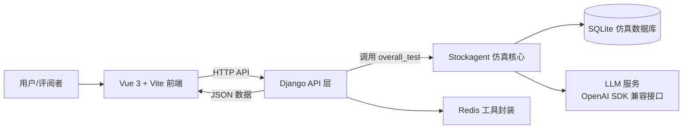
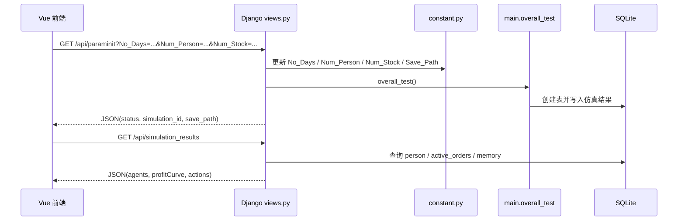
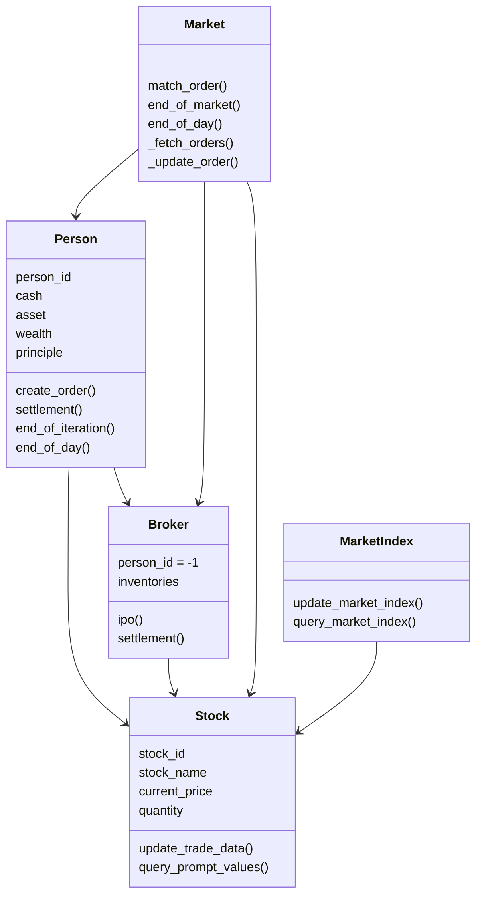
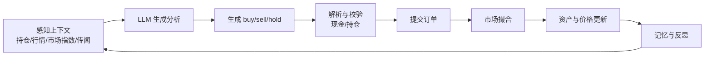
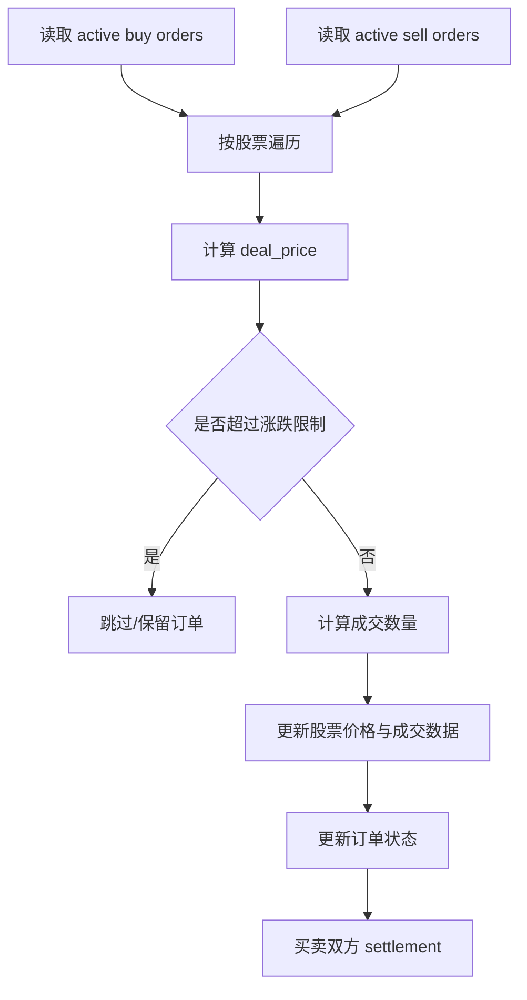
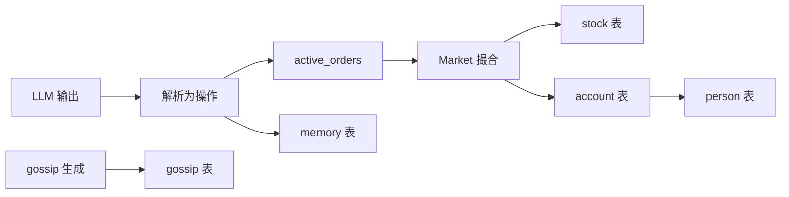
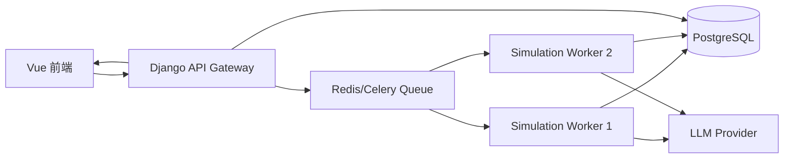

# AgentStock 系统架构说明

本文档说明 AgentStock V3 的详细架构、模块职责、核心数据流、运行链路和后续扩展点。项目定位为“多智能体交易竞技场：面向股票市场的语言驱动交易系统”，采用 Vue 前端、Django 后端、Stockagent 仿真核心和 SQLite 数据持久化的分层结构。

## 1. 架构总览

AgentStock 当前采用前后端分离 + 仿真核心内嵌后端的架构。前端负责参数配置和结果可视化，Django 负责 API 与调度，Stockagent 负责多智能体交易仿真，SQLite 保存仿真结果，LLM/Redis 作为外部能力接入。



核心链路：

1. 用户在前端首页设置模拟天数、Agent 数量、股票数量。
2. 前端调用 `GET /api/paraminit`。
3. Django `views.paraminit` 更新仿真常量、创建保存目录并调用 `overall_test()`。
4. Stockagent 初始化 Agent、股票、Broker、市场、数据库表。
5. 仿真循环中 Agent 生成决策，Market 撮合订单，SQLite 记录结果。
6. 前端通过结果 API 查询 SQLite 数据并展示图表。

## 2. 代码目录结构

```text
AgentStock_V3/
├── README.md
├── docs/
│   ├── architecture.md
│   ├── CS599_大作业报告.pdf
│   └── CS599_大作业报告.docx
└── src/
    └── AgentStock/
        ├── manage.py
        ├── db.sqlite3
        ├── AgentStock/
        │   ├── settings.py
        │   ├── urls.py
        │   ├── views.py
        │   ├── utils/
        │   │   └── redis_service.py
        │   └── Stockagent/
        │       ├── main.py
        │       ├── constant.py
        │       ├── Person.py
        │       ├── Stock.py
        │       ├── Market.py
        │       ├── behavior.py
        │       ├── database_utils.py
        │       ├── load_json.py
        │       └── content/
        ├── save/
        └── Fronted/
            ├── package.json
            ├── vite.config.ts
            └── src/
                ├── views/
                ├── components/
                ├── router/
                └── utils/
```

## 3. 分层架构

| 层级 | 主要目录/文件 | 职责 |
|---|---|---|
| 前端展示层 | `Fronted/src/views`, `Fronted/src/components` | 参数输入、进度展示、Agent 详情、股票行情、Agent 对比 |
| 前端通信层 | `Fronted/src/utils/http.ts` | Axios 实例，统一配置后端地址与超时时间 |
| Django API 层 | `AgentStock/urls.py`, `AgentStock/views.py` | 暴露 HTTP API，参数校验，调用仿真核心，读取 SQLite 并返回 JSON |
| 仿真编排层 | `Stockagent/main.py`, `Stockagent/constant.py` | 初始化系统、维护仿真参数、推进虚拟交易日 |
| Agent 行为层 | `Stockagent/Person.py`, `Stockagent/behavior.py`, `Stockagent/content/` | Agent 状态维护、LLM 决策、传闻生成、策略反思、下单 |
| 市场机制层 | `Stockagent/Market.py`, `Stockagent/Stock.py` | 股票价格维护、市场指数计算、订单撮合、成交结算 |
| 数据访问层 | `Stockagent/database_utils.py`, `load_json.py` | SQLite 表结构、查询解析、订单提交、对象快照保存 |
| 外部服务层 | LLM API, Redis | 模型推理、缓存/状态测试 |

## 4. 前端架构

前端位于 `src/AgentStock/Fronted`，使用 Vue 3 + Vite + TypeScript。

### 4.1 路由设计

`src/router/index.ts` 定义主要页面：

| 路由 | 页面组件 | 作用 |
|---|---|---|
| `/` | `Dashboard.vue` | 首页参数配置，启动仿真 |
| `/simulation` | `SimulationView.vue` | 展示每个 Agent 的策略、财富曲线和交易动作 |
| `/compare` | `ComparisonView.vue` | 展示不同 Agent 的财富曲线和最终资产对比 |
| `/stock` | `StockmarketView.vue` | 展示股票开高低收价格序列 |
| `/about` | `AboutView.vue` | 项目说明页面 |

### 4.2 前端数据访问

`src/utils/http.ts` 中创建 Axios 实例：

```ts
const http = axios.create({
  baseURL: 'http://localhost:8000',
  timeout: 300000
})
```

长超时时间用于适应 LLM 参与仿真时的慢请求。当前前端直接调用 Django API，尚未引入任务队列或轮询进度机制。

### 4.3 页面职责

- `Dashboard.vue`: 收集 `No_Days`、`Num_Person`、`Num_Stock`，调用 `/api/paraminit`。
- `SimulationView.vue`: 调用 `/api/simulation_results`，展示 Agent 维度结果。
- `StockmarketView.vue`: 调用 `/api/stock_data`，展示股票价格数据。
- `ComparisonView.vue`: 调用 `/api/agent_comparison`，展示收益对比。
- `AgentPanel.vue`: 单个 Agent 的收益曲线与交易列表。
- `StockPanel.vue`: 单个股票的数据面板。

## 5. 后端 API 架构

后端位于 `src/AgentStock`，Django 工程入口为 `manage.py`。

### 5.1 URL 路由

`AgentStock/urls.py` 注册接口：

| API | View | 说明 |
|---|---|---|
| `GET /api/paraminit` | `paraminit` | 初始化参数并启动仿真 |
| `GET /api/simulation_results` | `get_simulation_results` | 获取 Agent 财富曲线与交易动作 |
| `GET /api/stock_data` | `get_stock_data` | 获取股票 OHLC 数据 |
| `GET /api/agent_comparison` | `get_agent_comparison` | 获取 Agent 对比数据 |
| `GET /testcache` | `testcache` | Django 本地缓存测试 |
| `GET /redis_test` | `redis_test_view` | Redis 数据结构测试 |

### 5.2 API 调用链路



### 5.3 参数初始化接口

`paraminit` 做了以下工作：

1. 读取 URL 参数 `No_Days`、`Num_Person`、`Num_Stock`。
2. 校验参数范围。
3. 根据股票数量动态生成股票名称。
4. 更新 `Stockagent.constant` 中的全局参数。
5. 创建新的 `save/sim_YYYYMMDD_HHMMSS` 目录。
6. 调用 `overall_test()` 运行仿真。
7. 返回 `simulation_id`、`save_path` 等元数据。

当前注意点：仿真是同步执行的，LLM 调用较慢时 HTTP 请求会等待较久。后续建议改为异步任务。

## 6. 仿真核心架构

仿真核心位于 `AgentStock/Stockagent`，是项目的领域层。

### 6.1 核心对象关系



### 6.2 主循环

`main.py` 的 `overall_test()` 是仿真主入口。

```text
init_all()
for virtual_date in range(No_Days):
    if first day:
        broker.ipo()
    update_market_index()
    generate_gossip()
    for each iteration:
        ops = stock_ops()
        persons[i].create_order()
        market.match_order()
        market.end_of_market()
        update assets and market index
        save_all()
    market.end_of_day()
    persons.end_of_day()
    stocks.end_of_day()
```

对应 Agentic AI 循环：



## 7. Agent 行为设计

Agent 行为由 `behavior.py` 和 `content/` 下的 Prompt/LLM 封装共同完成。

### 7.1 行为生成流程

1. `generate_gossip()` 为每个 Agent 生成或记录传闻。
2. `analysis()` 汇总股票信息、市场指数、传闻、持仓和策略，生成股票分析。
3. `run_gpt_prompt_choose_buy_stock()` 生成买入建议。
4. `run_gpt_prompt_choose_sell_stock()` 生成卖出建议。
5. `extract_for_choose_buy()` / `extract_for_choose_sell()` 用正则解析 LLM 输出。
6. `Person.create_order()` 将解析结果转为订单，并校验现金/持仓。

### 7.2 行为约束

LLM 输出不会直接改变市场状态。订单必须满足：

- 买入：`bid_price * quantity < self.cash`
- 卖出：当前持仓存在，且 `quantity` 不超过持仓数量
- 订单类型必须是 `buy`、`sell` 或 `hold`
- 股票名称必须能映射到有效 `stock_id`

这使系统不是纯文本模拟，而是带状态约束的仿真。

## 8. 市场撮合设计

市场撮合由 `Market.py` 负责。

### 8.1 撮合流程



### 8.2 价格更新

成交后，股价由成交价、成交数量、当前价格、总发行数量和 `Fluctuation_Constant` 共同决定。成交量越大，对价格影响越明显。

### 8.3 订单状态

`active_orders.status` 主要包括：

- `active`: 等待撮合
- `finished`: 已成交
- `closed`: 日终关闭
- `partially fulfilled`: 代码逻辑中用于部分成交过程的语义状态

## 9. 数据架构

### 9.1 SQLite 表

`database_utils.py` 初始化主要表：

| 表名 | 作用 |
|---|---|
| `active_orders` | 保存订单、价格、数量、状态 |
| `stock` | 保存股票每日开盘、收盘、最高、最低、成交量 |
| `person` | 保存 Agent/Broker 每日现金、资产、财富、收益 |
| `account` | 保存每个 Agent 的持仓、成本价、当前价、收益 |
| `memory` | 保存 Agent 操作、策略、分析、传闻、财务上下文 |
| `gossip` | 保存市场传闻 |

### 9.2 数据写入路径



### 9.3 仿真保存目录

默认和动态保存路径：

- 默认：`save/sim01`
- 新仿真：`save/sim_YYYYMMDD_HHMMSS`

主要输出：

- `data.db`
- `persona.json`
- `stocks.json`
- `classes/*.pkl`
- `stock_*_price.jpg`
- `plot_order.jpg`
- `plot_person*_order.jpg`

## 10. LLM 与外部服务

### 10.1 LLM 客户端封装

`Stockagent/content/gpt_structure.py` 封装多类模型服务：

- OpenAI API
- DashScope / Qwen
- DeepInfra / Llama / DeepSeek
- Gemini

敏感信息已改为环境变量读取：

```text
OPENAI_API_KEY=
DASHSCOPE_API_KEY=
DASHSCOPE_BASE_URL=
DEEPINFRA_API_KEY=
DEEPINFRA_BASE_URL=
GOOGLE_API_KEY=
```

### 10.2 Redis

`AgentStock/utils/redis_service.py` 封装：

- String
- Hash
- Set
- List
- Sorted Set

Redis 配置：

```text
REDIS_HOST=
REDIS_PORT=
REDIS_PASSWORD=
REDIS_DB=
```

Redis 当前主要用于测试和扩展预留，尚未成为仿真主链路的强依赖。

## 11. 安全架构

已经完成的安全改造：

- 移除代码中的 LLM API Key。
- 移除 Redis 明文密码和远程地址。
- Django `SECRET_KEY` 改为 `DJANGO_SECRET_KEY`。
- 新增 `.env.example`，只提供变量名，不保存真实凭据。
- `.gitignore` 中包含 `.env`、`*.key`、`*.secret`。

仍需注意：

- 如果历史提交曾包含真实 Key，应在对应平台轮换。
- 不应把真实 `.env` 提交到仓库。
- 生产环境应关闭 `DEBUG`，限制 `ALLOWED_HOSTS`。

## 12. 当前架构限制

| 限制 | 影响 | 建议 |
|---|---|---|
| 仿真同步运行在 HTTP 请求中 | LLM 慢时请求阻塞 | 改为 Celery/后台任务 |
| 前端结果默认读取 `sim01` | 最新仿真不会自动展示 | 保存并传递 `simulation_id` |
| 部分查询/绘图固定 `save/sim01` | 多实验对比困难 | 所有查询统一传入数据库路径 |
| 缺少依赖锁文件 | 环境复现不稳定 | 增加 `requirements.txt` 或 `pyproject.toml` |
| 缺少自动化测试 | 回归风险较高 | 增加 Django API 测试和 Playwright 测试 |
| SQLite 适合单机原型 | 并发和多用户能力有限 | 扩展到 PostgreSQL |

## 13. 可扩展目标架构

后续可扩展为异步任务架构：



扩展后的收益：

- 前端可轮询任务进度。
- 支持多个仿真实验并发执行。
- 支持历史实验管理和对比。
- 支持 benchmark 多轮统计。
- 支持多模型、多策略、多市场扩展。

## 14. 总结

AgentStock 当前架构适合作为课程项目和研究原型：它把 LLM 决策、Agent 状态、市场撮合、SQLite 记录和前端可视化连接成闭环。系统的关键设计点是让 LLM 输出受到交易规则和账户状态约束，从而避免纯文本推演脱离可执行状态。

后续工程化重点应放在异步任务、结果管理、自动化测试、benchmark 评估和数据层扩展上。
